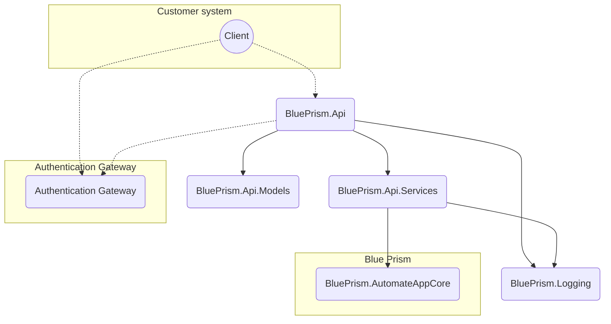

# Blue Prism API Design

In order to allow customers better programmatic access to Blue Prism an API is required. In v6 and before, it has become common practice for customers to use direct database access to create tools to perform functions which don't come natively with Blue Prism. This compromises the integrity of our software so there is a desire to provide an official approach to creating these tools.

## Solution overview

### BluePrism.Api

This is an ASP.NET 5 Web API project using .NET Framework 4.7 to keep requirements the same as with the core Blue Prism project.

The API is hosted using OWIN to decouple it from IIS.

The API outputs a Swagger 2.0 document to detail the available services. This document is the source of truth for the API's capabilities.

This project is a thin layer entirely concerned with API logic such as routing and mapping. All business logic should be in lower layers.

### BluePrism.Api.Models

This project contains the models used by the API. It is separate to the API project to enable other .NET projects to more easily consume the API.

If more than models are created to ease API consumption in the future then this project could be changed to an `Abstractions` project.

### BluePrism.Api.Services

This project contains any business logic that the API requires additional to that already contained in Blue Prism. This should be logic that is only required by the API - any logic that is relavant to the core Blue Prism product should go in there instead.

### BluePrism.Logging

This project contains logic for supporting logging. This isn't specific to the API but is only used here for now. If it seems useful for other projects it should be converted to a NuGet package and removed from this solution.

## Authentication

Authentication with the API will be handled by Authentication Gateway. Valid JWTs should be acquired using that service and these can then be sent to this service as bearer tokens in the Authorization header.

**Development note**

Until Authentication Gateway is in a state that JWTs can be acquired and validated, the API should support basic authentication. A username and password combination should be sent in the Authorization header as `username:password` base64 encoded.

## URL Structure

*This area requires further investigation*

## Versioning

*This area requires further investigation*

## Searching, filtering, and paging

*This area requires further investigation*

## Testing

Unit testing is achieved using the standard `BluePrism.Utilities.Testing` library. Unit tests for a project are found in `[Project Name].UnitTests` libraries. Unit test libraries must only include true unit tests (testing methods on a single class - the only other instantiated classes must be POCOs).

Integration testing is achieved using the standard `BluePrism.Utilities.Testing` library and components added in `BluePrism.Api.IntegrationTesting`. Integration tests are found in `BluePrism.Api.IntegrationTests`. Integration tests are any test which tests the functionality of 2 or more class implementations from within the project within the same test.

For integration tests which test API controllers, the tests class should inherit from `ControllerTestBase` class.

## Technology

The following is a list of key technologies being used by this project. Each item includes a brief description and the reason it is used in this solution if not immediately obvious.

### ASP .NET 5 [.NET Framework]

This covers a number of libraries which fall under the ASP .NET umbrella and are all covered by the same license. Together they form a framework for hosting Web APIs.

### Autofac 5.2.0 [MIT]

Autofac is a dependency injection framework. It is included in this solution to enhance the adapatbility and testability of the code.

### Autofac.Extras.DynamicProxy 5.0.0 [MIT]

Autofac.Extras.DynamicProxy is a library for generating interface proxies at runtime. It is used in this solution to automatically create trace logging interceptors.

### Autofac.WebApi2 5.0.0 [MIT]

Autofac.WebApi2 is an addon for Autofac which adds support for dependency injection in WebAPI controllers.

### Castle.Core 4.4.1 [Apache 2.0]

Castle.Core is a library for generating CLI objects at runtime. It is used in this solution by Autofac.Extras.DynamicProxy.

### Castle.Core.AsyncInterceptor [Apache 2.0]

Castle.Core.AsyncInterceptor is a library for intercepting asynchronous calls. It is used in this solution by the trace logging framework.

### Func 0.1.9 [MIT]

Func is a library for enhancing the language features of C#.

### Microsoft.Owin 4.1.0 [Apache 2.0]

Microsoft.Owin is a Microsoft implementation of the OWIN standard. This allows the API to be hosted on servers other than IIS should this be required.

### Microsoft.Owin.Host.SystemWeb [Apache 2.0]

Microsoft.Owin.Host.SystemWeb provides support for serving OWIN-hosted websites from IIS.

### Microsoft.Owin.Hosting 4.1.0 [Apache 2.0]

Microsoft.Owin.Hosting provides support for hosting ASP sites in OWIN

### Newtonsoft.Json 12.0.2 [MIT]

Newtonsoft.Json is a library for JSON serialization operations.

### NLog 4.7.3 [BSD 3-Clause]

NLog is a library for adding flexible logging support to software.

### Owin 1.0.0 [Apache 2.0]

Owin provides startup comoponents for initalising OWIN-hosted websites.

### Swashbuckle.Core 5.6.0 [BSD 3-Clause]

Swashbuckle is a library for automatically generating and serving Swagger documentation based on an API.
